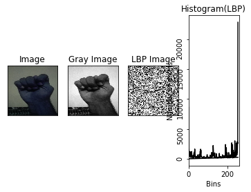

# Pakistan Sign Language (PSL) Recognition using SVM and Local Binary Patterns

...

## Thesis PDF
The detailed documentation and findings of this project are available in the [thesis PDF](Thesis.pdf).

...

## Overview

Sign languages play a crucial role in the deaf community, forming the core of local deaf cultures. This project focuses on recognizing Pakistan Sign Language (PSL) using Support Vector Machines (SVM) and Local Binary Patterns (LBP). The motivation stems from the need to empower children who are unable to hear or speak by providing them with a modern technique for sign language recognition.

## Project Objective

The main objective of this project is to develop a system capable of interpreting sign language gestures captured in images. For instance, given an image featuring a sign representing a particular alphabet, the system should process the input and output the corresponding alphabet.

## Sign Language Structure

Sign languages, like PSL, are complex and include various elements such as phonemes, non-manual features, placement, classifiers, directional verbs, positional signs, body shift, iconicity, and finger spelling. Understanding and recognizing these elements pose significant challenges in the field of Sign Language Recognition (SLR).

## Implementation Details

### Dataset

The dataset used for training and testing contains images representing various signs in PSL.

### Histogram Calculation Output
The project involves the calculation of Local Binary Patterns (LBP) histograms for each image. The process includes converting the original photo to its grayscale representation, generating the LBP image, and calculating the corresponding histogram.

### Training Results
The SVM model is trained using the LBP features. The output of the training phase is essential for the subsequent testing phase.

### Testing Results
During the testing phase, the system processes new images and predicts the corresponding sign using the trained SVM model.

## Conclusion

This project marks an initial step toward modernizing sign language recognition for Pakistan, with a specific focus on PSL. By utilizing SVM and LBP, the system demonstrates promising results in recognizing signs from images. Further research and improvements can enhance the accuracy and efficiency of sign language recognition systems.

## Dataset Usage

The dataset created during this thesis is actively being used in various research projects. Here are three instances where the dataset has played a pivotal role:

1. [Symmetric mean binary pattern-based Pakistan sign language recognition using multiclass support vector machines](https://link.springer.com/article/10.1007/s00521-022-07804-2)

2. [Sign Language Recognition Using Multiple Kernel Learning: A Case Study of Pakistan Sign Language](https://ieeexplore.ieee.org/document/9422714)

3. [Shape Based Pakistan Sign Language Categorization Using Statistical Features and Support Vector Machines](https://ieeexplore.ieee.org/document/8480101)

If you are interested in accessing the dataset, please contact the person in charge [here](https://scholar.google.com.pk/citations?user=Y6gI5eQAAAAJ).

...

## Contributors

We want to express our gratitude to the following individuals who have contributed to the development of this project:

- [Nouman Dilshad - Group Partner](https://github.com/NoumanDilshad)
- [Syed Muhammad Saqlain Shah - Thesis Supervisor](https://scholar.google.com.pk/citations?user=Y6gI5eQAAAAJ&hl=en)

If you'd like to contribute to this project, please feel free to open a pull request or submit an issue.

...

---

*This project was conducted as a Bachelor's thesis with the aim of contributing to the accessibility and inclusivity of individuals who rely on sign language for communication.*